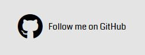

# Minesweeper

Minesweeper is a logic puzzle game that features a grid of tile. Each tile can be revealled to show a number or a mine. If a mine is revealled, the game is over. The number that is revealed shows how many of it's eight neighboring tiles are mines. The player must use logic to reveal off of the non-mine tiles to win. 

[Minesweeper](https://kristfur.github.io/minesweeper/) is a recreation of this classic game in the form of a responsive website that can be played anywhere.

# Table of Contents
* [User Experience](#user-experience)
    * [Site Goals](#site-goals)
    * [User Stories](#user-stories)
    * [Design](#design)
        * [Wireframes](#wireframes)        
        * [Layout](#layout)
        * [Color Scheme](#color-scheme)
* [Features](#features)
    * [Site Wide](#site-wide)
        * [Header](#header)
        * [Footer](#footer)
        * [Favicon](#favicon)
        * [404 Page](#404-page)
    * [Home Page](#home-page)
    * [Rules Page](#rules-page)
    * [Settings Page](#settings-page)   
    * [Game Board](#game-board)
        * [Game Information](#game-information)
        * [Helpful Buttons](#helpful-buttons)
    * [Gameplay](#gameplay)
        * [Click to Reveal](#click-to-reveal)
        * [Flags](#flags)
        * [Sounds](#sounds)
    * [Keyboard Controls](#keyboard-controls)
    * [Lose Page](#lose-page)
    * [Win Page](#win-page)
    * [Leaderboards](#leaderboards)
* [Technologies](#technologies)
* [Testing](3testing)
    * [Validator Testing](#validator-testing)
    * [Unfixed Bugs](#unfixed-bugs)
    * [Notable (Fixed) Bugs](#notable-fixed-bugs)
* [Deployment]
    * [Version Control](#version-control)
    * [Deployment to GitHub Pages](#deployment-to-github-pages)
    * [Clone the Repository Code Locally](#clone-the-repository-code-locally)

# User Experience
## Site Goals
* To provide a fun and quick logic game for the user to play
* To have an intuitive menu so users don't have to look far for what they want
* To have a selection of difficulty options for the user to choose from
* To ensure the game is fully acessible on all devices from desktops to mobile touchscreen devices
* To ensure the game is fully playable with only a keyboard

## User Stories
* As a user, I want a fun and quick logic game to play
* As a user, I want to play an easier version of the game
* As a user, I want to play a more challenging version of the game
* As a user, I want to be able to play the game with only a keyboard
* As a user, I want my previous high scores to be saved
* As a user, I want the game to have sound that I can toggle on and off

User Story:

> As a user, I want a fun and quick logic game to play

Acceptance Criteria:
* It should be clear that it is a game, and how to play

Implementation:
* The focus of the home page is a large button the the center that prompts the user to 'PLAY', making it clear that it is a game. The rules can be acessed easily from the home page and during gameplay providing information about how to play.

User Story:

> As a user, I want to play an easier version of the game

> As a user, I want to play a more challenging version of the game

Acceptance Criteria:
* The user should be able to change the difficulty of the game with ease, either to an easier version or more difficult version

Implementation:
* The user can navigate to the settings page from the home page and easily select size of the game board and the concentration of mines on the board, modifying the difficulty to the users' will

User Story:

> As a user, I want to be able to play the game with only a keyboard

Acceptance Criteria:
* The game and all of it's features must be fully accessible through only the use of a keyboard

Implementation:
* The user will be able to navigate the website with a keyboard and play the game in it's entirety only using a keyboard. Instructions on keyboard controls will be found in the rules section.

User Story:

> As a user, I want my previous high scores to be saved

Acceptance Criteria:

* The game must save the users score and have it be visible even on the next session

Implementation:
* Once the user completes the game, they will be offered the option to enter they name and save their time. This score will be saved to the local storage and be accessible to the user the next time they open the website

User Story:

> As a user, I want the game to have sound that I can toggle on and off

Acceptance Criteria:

* The website must have sound effects that the user can turn on and off

Implementation:
* In the settings, the user has an option to turn sounds on and off. The sounds provite immidate reactions for every action that is perfomred in the game

## Design
### Wireframes

Title page

Rules page

Settings page

Leaderboard page

Game page

Win page

404 page

### Layout
The layout of the content on each page was chosen to minimise distraction and make it easy for the user to navigate the website, so the user can focus on the game and have hastle-free fun. The pages do not overwhelm the user with all of the information always being visible, but provide the option to easily seek the information they may need through intuative buttons. 

### Color Scheme
The color scheme of the website was chosen to be true to the classic game. The game board features gray tiles that are reveal colorful numbers. The game becomes more colorful as the game progresses, rewarding the users who play well. The home page mimics the game board with gray buttons and colorful letters 'PLAY', while also providing suitable contract for accessibility.

# Features
## Site Wide
### Header
- A large clear logo with the name of the game.
- Lets the user know the name of the game that they are playing, easily visible on every page.
- The logo is clickable and provides an easy way to return to the home page.
- At any point, from any page, the user may choose to return to the home page by clicking on the logo.
- When the mouse hovers over the logo, the cursor changes to a pointer letting the user know that the logo is clickable.

### Footer
- Contains a GitHub icon and text prompting the user to follow me on GitHub.
- Provides the user a link to my GitHub page that open in a new tab when clicked.

### Favicon
- The favicon is the reconisable bomb icon that appears in the game.
- Allows the user to easily identify website from browser tabs.

### 404 Page
- This page will display if the user navigates to a broken link.
- The page features text and a link that brings the user back to the home page.
- Additionaly, the 404 page will automaticaly redirect the user to the home page aster 10 seconds if no action is taken.
- This informs the user that they entered an invaild link and provides them an easy way to get back to safety.

## Home Page
- Main content of the home page is a large play button.
- The large play button is easily identifyable and makes it clear to the user that they are about to play a game.
- There are several smaller buttons that provide the user acess to the rules, settings and leaderboard while not getting in the way of or distracting from the play button.

## Rules Page
- Informs the user on how to play the game, the controls are easy and intuative.
- In this page, the user can learn what the aim of the game is, and how to play.
- The rules page can be closed by clicking out of the container, or by clicking on the (x) at the top.
- The (x) glows red when the user hovers over it, indicating that it can be clicked.

## Settings Page
- Here the user can change the difficulty of the game, they can increase or decrease the size of the board and the concentration of mines.
- This allows the user to play an easier version of the game, and to play a more challening version.
- The user can also choose to enable sound for the game, providing a more engaging gaming experience.
- The settings page can be closed by clicking out of the container, or by clicking on the (x) at the top.
- The (x) glows red when the user hovers over it, indicating that it can be clicked.

## Game Board
### Game Information
- Displays the number of mines remaining and the time elapsed since the first click
- Mines remaining gives the user information to help them solve the game. Every flag the user places will reduce this number, any incorrectly flags will skew this number, punishing the user for placing flags incorrectly.
- The timer gives the user some live feedback on how fast they are completing the game.

### Helpful Buttons

- The game page features four buttons with different, but self explanitory actions:
    - Reset - Resets the game board to a new game. (For when the user wants to start a new game)
    - Home - Brings the user to the home screen.
    - Rules - Displays the rules to the user. (For when the user forgets the rules, it does not reset the current game)
    - Leaderboard - Brings the user to the leaderboard page.

## Gameplay

### Click to Reveal
- Every tile is either a mine or a number representing the number of neighboring mines, zeros are blank tiles.
- The numbers on the tiles are large and easily readable, conveying it's information to the user in an effective manner.
- The first tile the user clicks is never a mine. This prevents the situation where the user loses without event starting to play. This feature greatly improves the gaming experience.
- If the user reveals a tile with no neighboring mines, a zero (or an empty tile), the game will automaticaly reveal all of the neighboring tiles, since none of them are mines. This removes the tedious task that the user would be doing anyway, improving the gaming experience. 

### Flags
- Are used to mark where the user thinks mines are located
- The flags also help the user by making the tile never be reveal when they click on it, helping to prevent misclicks that would end the game. The user must first remove the flag before thay can reveal the tile.

### Sounds
- The game is best playes with sounds enabled, the user can enable sounds through the settings.
- Every action has a unique sound corrosponding with what action was performed, the different sounding actions are:
    - Click on a menu button
    - Reveal a tile
    - Place/remove flag on/from a tile
    - Revel a mine
    - Win the game
- These sounds help to enhance the user's experience while playing the game.

## Keyboard controls
- The game supports full keyboard controls, these controls are easy to learn. (WASD to move focus, Q to reveal tile, E to place/remove flag)
- This allows users to enjoy the game using only a keyboard.
- The user can find the keyboard controls in the settings.
- When using keyboard controls, the focused tile will be highlited so the user can easilt identify it.
- When using the mouse to click after the keyboard focus has appeared, the keyboard focus will disappear to remove confusion. 

## Lose Page
- When the user reveals a mine tile, they lose the game and this page displays. It features a home button and a try again button.
- This page mmakes it clear to the user that they lost and  prevents the user from playing that game further. It gives the user the option to return to the home menu, or to immediately try again.

## Win Page
- Displays win text, the user's time, a text input and two buttons, one to save the score and the other to not save the score.
- This page makes it clear to the user that they won and it gives them the option to save their score so they can look at it in the future.
- Times are saved to the nearest millisecond, ensuring the times are more accurate.
- The scores are saved to local storage and can be accessed through the website on the same device it was saved on.
- If the user decides to save their score, they must enter a valid name and click save, then they will be taken to the leaderboard page.
- If the user decides to not save their score, a warning will display, letting the user know their score will not be saved and giving them a final choice to return or continue. 

## Leaderboards
- The leaderboard displays all of the users past scores that they saved on that device. It displays the rank, anme and time of the top-5 fastest times.
- Each category has their own leaderboard that the user can easily navigate to from this page using the drop-down menu.
- If a score had not been saved yet, a placeholder of (...) is displayed instead, indicating that the data is empty.
- If the user just saved a new score, that score will be highlited so the user can easilt identify it on the leaderboard. That score will still be displayed even if it did not make the top 5 scores. 
- A back button is present, proving an easy way for the user to return to the home page.

User's score is not in top 5

# Technologies
- HTML
    - The structure of website was built with HTML code

- Css
    - The website was styled with a CSS file

- Gitpod
    - The website was developed using [gitpod.io](https://gitpod.io)

- GitHub
    - The source code is hosted on [GitHub](https://github.com/Kristfur/lawnscapes-landscaping) and deployed with Git Pages ([Link to live website](https://kristfur.github.io/lawnscapes-landscaping/))

- Git
    - Used for version control during the development of the website

- Dev Tools
    - Used throughout the development process to test code with instant feedback

- Font Awesome
    - Icons for the social media in footer were obtained from [https://fontawesome.com/](https://fontawesome.com/)

- Favicon.io
    - Favicon files were created by [https://favicon.io/](https://favicon.io/)

- remove.bg
    - Whitespace in image background was removed with [https://www.remove.bg/](https://www.remove.bg/)

- balsamiq
    - Wireframe diagrams were created using [balsamiq](https://balsamiq.com/)

# Testing
Throughout development there was constant testing to ensure the functions gave the desired outputs and that there was no unpredictable outcomes. Testing was performed on mobile devices as well as desktop browsers to ensure functinality as intended. 

A more structured testing procedure was also performed. Details of this report can be found [here](TESTING.md).

## Validator Testing

- HTML 
    - No errors showed up when checking with the [W3C Validator](https://validator.w3.org/)

- CSS
    - No errors showed up when checking with the [(Jigsaw) Validator](https://jigsaw.w3.org/css-validator/)

- JS
    - Five warnings showed up when checking with [JSHint](https://jshint.com/)
    - Two of those warnings refer to declaring functions in loops referencing an outer scoped variable. For this, I was folowing a Code Institute example.
    - The remaining three warnings are refering to 'optional catch binding' only being available is ES10.

## Unfixed Bugs

Currently there are no know bugs, if you happen to come across a bug, please let me know and I will address it in a future release.

## Notable (Fixed) Bugs 

During development, one notable and recurring bug that has been fixed was the long press for touchscreen devices. It was not possible to place a flag on any of the tiles. I traced the cause of this down to two factors. Firstly, I was using the wrong event listener for such a task, I changed 'touchup' to 'touchend'. This made it possible for a flag to be placed sometimes, but when the long touch occured, the tile items got selected by the device. This made it unpleasant to play because you had to unselect the items before you can keep plaing the game. To fix this, I added the 'preventDefault' method to the event, and also added CSS code that prevents the tiles being selected at all. ([Credit](https://stackoverflow.com/questions/924916/is-there-a-way-to-make-a-div-unselectable): stackoverflow.com  User: aleemb)

These alterations and additions resulted in this bug being fixed.

# Deployment

## Version Control
This website was pushed to GitHub to the remote repository '[minesweeper](https://github.com/Kristfur/minesweeper)'.

The following Git commands were used throughput development:

    git add <file> 

Was uesd to add files to the staging area before they are commited.

    git commit -m "commit message"

Was used to commit changes to the local repository queue.

    git push

Was uesd to push all committed code to the remote repository on GitHub.

## Deployment to GitHub Pages
This website was deployed to GitHub Pages, the steps of deployment are:
1. In the GitHub repository, navigate to settings
2. In settings, navigate to Pages
3. In the source selection, select the branch *main*
4. Click 'save'
5. The live website link will appear near the top of the page after some time

The live linke can be found here [https://kristfur.github.io/minesweeper/](https://kristfur.github.io/minesweeper/)

## Clone the Repository Code Locally

The steps to clone the repository are as follows:

1. From the repository, click the *code* drop down menu
2. Click on *HTTPS*
3. Copy the link
4. Open your IDE (that has git installed)
5. Paste the git command into the IDE terminal
6. The project is now cloned on your local machine
